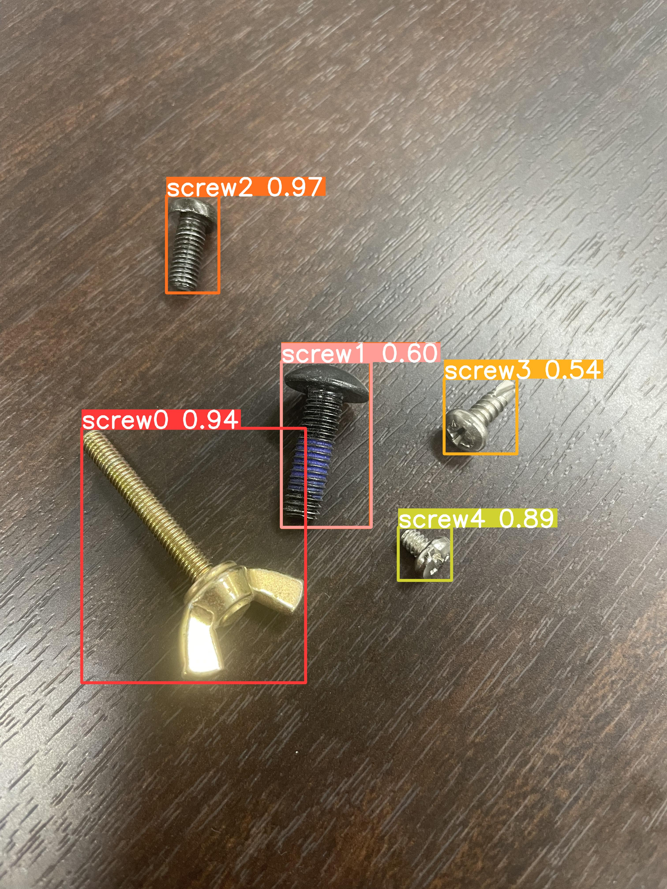

# screw-detection with YOLOv8
This repository is a task to detect screws using [YOLOv8](https://github.com/ultralytics/ultralytics). You can experiment with the screws you want to detect :fire:

＊ Please refer to the README.md of yolov5 directory for how to build the dataset

### 1. Fine tuning with yolov8

```
python finetune_yolo.py
```

### 2. Run the trained model
```
python run_yolo.py
```

- sample-image

